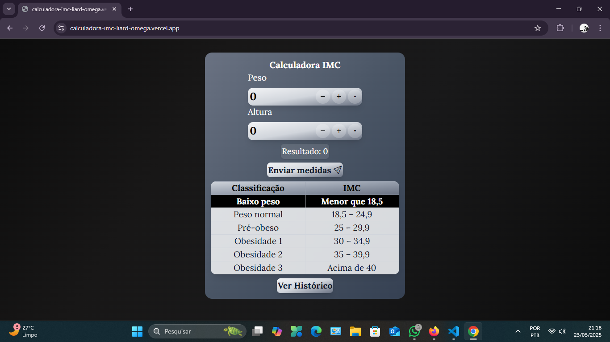
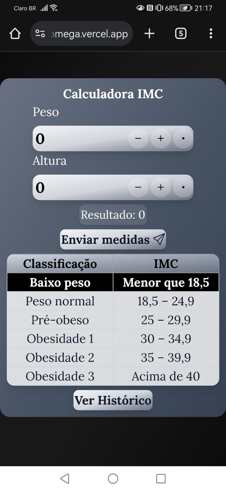

# 📊 Calculadora de IMC (Índice de Massa Corporal)

Este é um projeto desenvolvido em **Next + TypeScript**, hospedado na **Vercel**, que calcula o IMC de forma prática, responsiva e com histórico de medições.  
Além do cálculo, o app fornece uma **tabela informativa** com as classificações do IMC e permite visualizar um **histórico detalhado das entradas**.

---

## 📌 Funcionalidades

- ✅ Cálculo automático do IMC
- ✅ Entrada de dados com botões de incremento, decremento e vírgula
- ✅ Histórico de medições com opção de limpar
- ✅ Responsividade total (Mobile, Tablet e Desktop)
- ✅ Estilização moderna com **TailwindCSS**
- ✅ Fontes personalizadas com Google Fonts
- ✅ Interface interativa e acessível
- ✅ Deploy completo na Vercel

---
## 🔭 Veja o app em funcionamento 

[](https://calculadora-imc-liard-omega.vercel.app/)

---

## 🧪 Tecnologias Utilizadas

| Ferramenta | Descrição |
|------------|-----------|
| [Next.js](https://nextjs.org/) | Framework React com suporte a SSR/SSG |
| [React](https://reactjs.org/) | Biblioteca principal para criação da UI |
| [TypeScript](https://www.typescriptlang.org/) | Tipagem estática para maior robustez |
| [Tailwind CSS](https://tailwindcss.com/) | Utilitário de classes para estilização moderna |
| [Vercel](https://vercel.com/) | Plataforma de deploy automatizado |
| [Google Fonts (Lora)](https://fonts.google.com/specimen/Lora) | Fonte serifada e legível |

---

## 🖼️ Layout

> 💻 Desktop | 📱 Mobile

| Desktop             | Mobile              |
|---------------------|---------------------|
<div align="center">
  
  
</div>

---

## 🔄 Responsividade

A aplicação detecta automaticamente a largura da tela:
Largura	Classe CSS Aplicada	Adaptação visual

| Tamanho | Dispositivo |
|------------|-----------|
| ≤ 640px |	ajuste_m	Mobile|
| 641px até 1024px | ajuste_t	Tablet|
|> 1024px |	ajuste_d	Desktop|

---
## 🧮 Como funciona o cálculo?

A fórmula usada é:
```ts
IMC = Peso (kg) / (Altura (m) * Altura (m))
Exemplo:
Se você pesa 70 kg e tem 1,75 m de altura:

IMC = 70 / (1.75 × 1.75) ≈ 22.86
```

## 📦 Instalação Local

```
# Clone o repositório
git clone https://github.com/seu-usuario/seu-repo-imc.git
cd seu-repo-imc

# Instale as dependências
npm install

# Rode o projeto localmente
npm run dev
```
## 🔒 Validação de Entradas

  - Limita o valor do peso até 635kg.
  - Limita a altura até 2.51m.
  - Suporte a , e . como separador decimal.
  - Previne valores não numéricos.

## 🧹 Histórico

Cada vez que o usuário envia o peso e a altura válidos, um novo item é adicionado ao histórico com:

- Peso digitado

- Altura digitada

- IMC calculado

- O botão “Limpar Histórico” remove todas as entradas.

## 🤝 Contribuições

Contribuições são sempre bem-vindas!
Se tiver ideias para melhorar a calculadora ou deseja relatar um bug, abra uma issue ou um pull request.

## 🧑‍💻 Autor

Desenvolvido por: Anathyon Erysson

📧 anathyon@protonmail.com  
💼 [LinkedIn](https://www.linkedin.com/in/anathyonerysson/)
